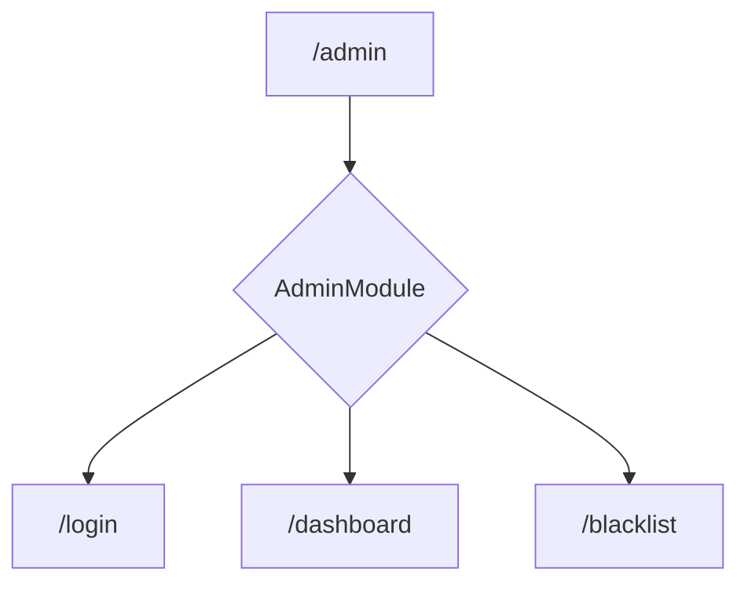
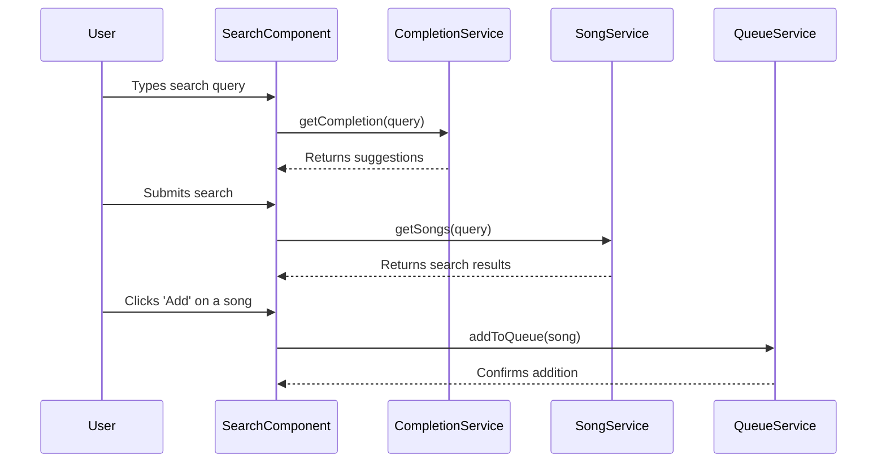

# Jambox - Developer Guide

A comprehensive guide for developers working on the Jambox application. This document covers everything from local setup to deployment.

## Table of Contents

- [Local Development Setup](#local-development-setup)
- [Architecture Overview](#architecture-overview)
- [Coding Standards and Testing](#coding-standards-and-testing)
- [Build and Deployment](#build-and-deployment)

## Design System

The Jambox UI is built with a custom design system that prioritizes clarity, consistency, and accessibility. This system is implemented using Tailwind CSS.

### Color Palette

The core color palette is defined in `tailwind.config.js` and includes the following colors:

-   `jambox-dark`: `#1C2039` (Primary dark background)
-   `jambox-purple`: `#4F46E5` (Accent and primary actions)
-   `jambox-light-text`: `#A9B2CC` (Secondary text on dark backgrounds)
-   `jambox-dark-light`: `#3E446A` (Lighter dark shade for UI elements)

### Typography and Components

For detailed information on typography, component styles, and UI patterns, please refer to the complete [Design System Guide](DESIGN_SYSTEM.md).

## Local Development Setup

To get Jambox running on your local machine, you'll need Node.js and npm.

### Prerequisites

- **Node.js**: We recommend using the latest LTS version. You can download it from [nodejs.org](https://nodejs.org/).
- **npm**: This is included with Node.js.

### Installation

1.  **Clone the repository:**
    ```bash
    git clone https://github.com/your-username/jambox-front.git
    cd jambox-front
    ```

2.  **Install dependencies:**
    ```bash
    npm install
    ```

### Running the Application

Once the dependencies are installed, you can start the local development server:

```bash
npm start
```

This will launch the application on `http://localhost:4200/`. The app will automatically reload if you change any of the source files.

## Architecture Overview

Jambox is built with Angular using a modern, standalone component architecture. This approach promotes a modular and maintainable codebase by reducing the reliance on NgModules.

### Project Structure

The project is organized into the following key directories:

-   `src/app/`: Contains the core application logic.
    -   `admin/`: A lazy-loaded module for all administrative features.
    -   `core/`: Core services, models, and singleton modules.
    -   `layout/`: The main layout component, providing the application's shell.
    -   `shared/`: Reusable components, directives, and pipes.
    -   `assets/`: Static assets like images and translation files.
-   `src/environments/`: Environment-specific configuration.

### Standalone Components

The application is built primarily with standalone components. The root component, `AppComponent`, bootstraps the application and uses `RouterOutlet` to render the appropriate component based on the current route.

### Routing

Application routing is defined in `src/app/app.routes.ts`. Key routes include:

-   **`/`**: The main search interface (`SearchComponent`).
-   **`/qr-code`**: Displays the QR code for joining the queue (`QrCodeComponent`).
-   **`/admin`**: Lazy-loads the `AdminModule`, which contains all administrative routes and components. This helps keep the initial bundle size small.
-   **`**`**: A wildcard route that displays a "Not Found" page.

### Internationalization (i18n)

The application supports multiple languages using the `ngx-translate` library. Translation files are located in `src/assets/i18n/` as JSON files. The `TranslateService` is configured in `app.config.ts` and initialized in `AppComponent`.

### Admin Module (Lazy-Loaded)

The `AdminModule` is a lazy-loaded feature module that contains all administrative functionality. This helps keep the initial application bundle small and improves performance.

-   **Routing:** The module defines its own routes in `admin-routing.module.ts`, which are relative to the `/admin` path.
-   **Components:** It includes components for login, the main dashboard, and managing the song blacklist.



### Core Module & Services

The `src/app/core` directory contains the application's core logic, including singleton services and data models. These services are provided at the root level and are available throughout the application.

Key services include:

-   **`queue.service.ts`**: Manages the collaborative song queue, including adding, removing, and updating songs.
-   **`song.service.ts`**: Handles fetching song data from external sources.
-   **`blacklist.service.ts`**: Manages the song blacklist.
-   **`notification.service.ts`**: Provides a system for displaying in-app notifications.
-   **`theme.service.ts`**: Manages the application's light and dark themes.
-   **`spotify.service.ts`**, **`youtube.service.ts`**, **`amazon.service.ts`**: Services for interacting with music provider APIs.

### Data Flow Example: Searching and Adding a Song

To illustrate how the components and services work together, here is a typical data flow for a user searching for a song and adding it to the queue:

1.  **User Input**: The user types a search query into the `SearchComponent`.
2.  **Autocomplete**: The `SearchComponent` uses a debounced stream (`queryInput$`) to send the query to the `CompletionService`, which provides search suggestions.
3.  **Search Execution**: When the user submits the search, the `SearchComponent` calls the `SongService.getSongs()` method.
4.  **API Interaction**: The `SongService` then communicates with the appropriate music provider service (e.g., `SpotifyService`, `YoutubeService`) to fetch the search results.
5.  **Display Results**: The results are displayed in the `SearchResultsComponent`.
6.  **Add to Queue**: When the user adds a song, the `SearchComponent` calls the `QueueService.addToQueue()` method.
7.  **Queue Management**: The `QueueService` adds the song to the shared queue and notifies all subscribed components of the change.



## Coding Standards and Testing

This project follows the standard Angular style guide. We use ESLint to enforce consistent code style.

### Linting

To check your code for linting errors, run:

```bash
ng lint
```

### Running Tests

This project uses Jasmine and Karma for unit testing. To run the tests, use the following command:

```bash
npm test
```

This will run the tests in a watch mode, automatically re-running them as you make changes.

## Build and Deployment

To build the application for production, use the following command:

```bash
npm run build
```

This will create a `dist/` directory with the production-ready files. You can then deploy the contents of this directory to any static web server.